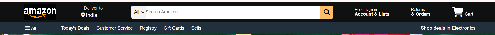
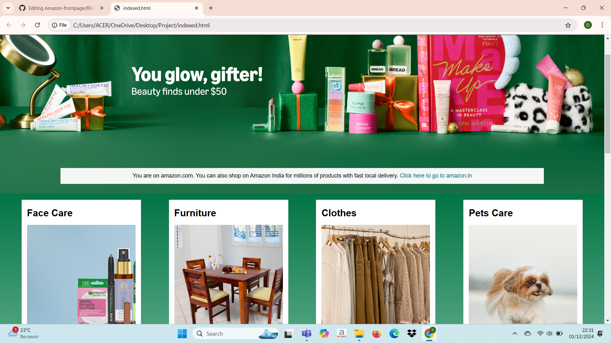
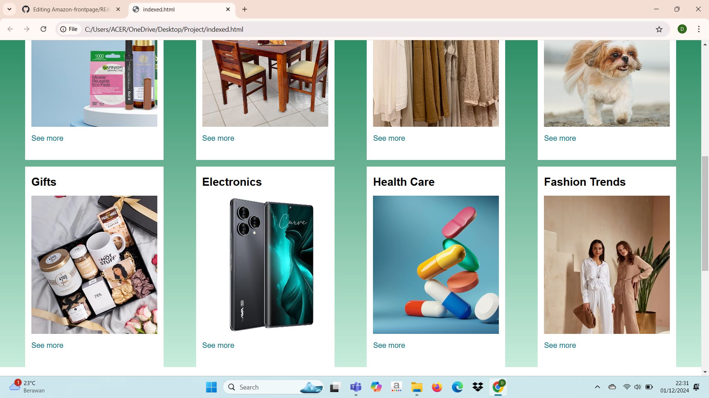
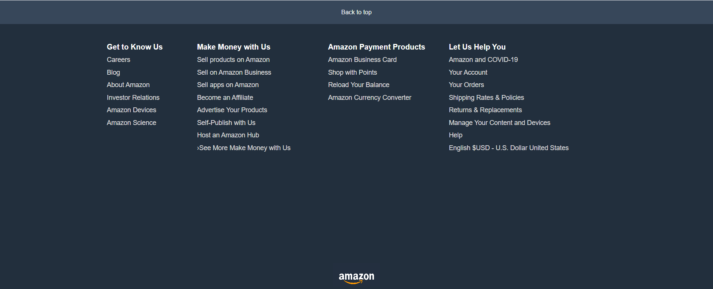

# Amazon Frontpage
This repository contains the source code for a front-end clone of Amazon's homepage, built using HTML and CSS.
The project replicates the layout and design elements of Amazon's homepage, offering a simple and clean 
structure for learning front-end web development.

## Features
**- Responsive Design :** The page is fully responsive and adapts to various screen sizes, from desktops to mobile devices. 
**- Header Section :** Includes a navigation bar with a logo, search bar, and links. 
**- Product Grid :** Displays a set of product images with titles and descriptions, organized into a grid layout. 
**- Footer Section :** Contains links to various Amazon services and additional information. 

## Technologies Used
**- HTML :** For structuring the webpage content. 
**- CSS :** For styling the page and making it responsive across different devices. 

## How to Run
To view or use this project locally, follow these steps: 
1. Clone the repository: 
git clone https://github.com/Drushti008/Amazon-frontpage.git
2. Open the index.html file in your browser.  

## Screenshots
### Navigation Bar

### Hero Section

### Product Grid Layout

### Footer Section

## Future Enhancements
- Add Javascript for interactivity. 
- Implement backend functionality using PHP 
- Add responsiveness for better mobile compatibility 

